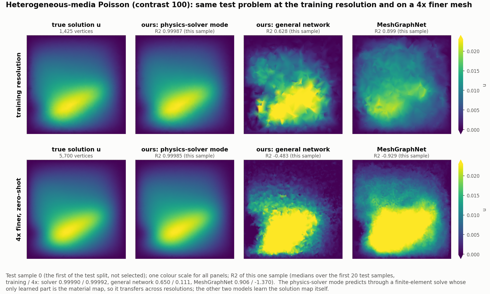

# RHMP v2: learning physical fields on meshes through a learned discrete metric

`rhmp` is a PyTorch library for learning physical fields on meshes: temperatures, pressures, potentials, fluxes and
gauge fields on triangle meshes, curved surfaces and tetrahedral volumes.  Its one design decision: the mesh is turned
into an exact discrete calculus (a *cochain complex*, with fields living on vertices, edges, faces or cells), and every
operator the network applies is a discrete gradient, divergence or Laplacian assembled from that calculus and a
learned **metric**, a per-cell material tensor.  Nothing else in the network moves information across the mesh.

That single choice buys four things that ordinary mesh networks lack: models that work on meshes and resolutions they
were never trained on, exact conservation laws and symmetries, correct treatment of anisotropic materials, and a model
whose learned metric can be read off as the physical material.

This is version 2 (v2) of the code of *Learning Discrete Riemannian Metrics for Physical Fields with Cochain-Frame
Equivariance* (Zheng & Allen-Blanchette, arXiv:2608.14556).  Compared with the paper's original code (v1), the
implementation, the algorithms and the benchmark tasks are new.  Every number below is documented in the technical
report [REPORT.md](REPORT.md); the per-run tables are in [results/RESULTS.md](results/RESULTS.md).

## Two kinds of models

* **The physics-solver model** (a few thousand parameters).  The network only produces the metric, i.e. the material
  tensor of every cell, from local inputs; the model then *solves* the discrete PDE with that metric, exactly as a
  finite-element solver would.  Its only nonlinearity is the map from inputs to material.  The report calls this
  *solver mode*.
* **The general network** (about 90K parameters).  A nonlinear message-passing network in which every propagation step
  is still a metric-weighted discrete operator, but with learned features, gates and several layers.  The report calls
  this the *general stack*.

Scores are R2 (coefficient of determination; 1 is a perfect prediction).  "4x-resolution" means the trained model is
evaluated, without any retraining, on meshes four times finer than those it was trained on.

## Four results

**1. Anisotropic materials need a tensor metric, and the library has one.**  A material whose conductivity depends on
direction (layered rock, fibres, a stretched grid) leads to discrete operators with negative couplings between
neighbouring vertices.  A metric with one number per cell (a *diagonal metric*) can only produce non-negative
couplings, so it cannot represent such materials, whatever it learns.  A full symmetric positive-definite tensor per
cell (the *tensor metric*) can, and it reproduces exactly the finite-element operators of anisotropic diffusion and
of curl-curl problems ([docs/THEORY.md](docs/THEORY.md)).  With the physics-solver model:

| task (test R2 / 4x-resolution R2) | diagonal metric | tensor metric |
|---|---:|---:|
| 2-D diffusion, anisotropy ratio 100, principal axes not aligned with the mesh | 0.832 / 0.699 | **0.964 / 0.958** |
| the same with ratio 10 | 0.965 / 0.914 | **0.992 / 0.928** |
| fibre diffusion on curved closed surfaces, ratio 100 | 0.823 / 0.822 | **0.961 / 0.956** |
| 3-D Darcy flow in a tetrahedral volume, ratio 100 (1500 samples) | 0.919 / 0.866 | **0.977 / 0.970** |
| the paper's electrostatics task (its reference data contain negative couplings); first 100 test samples | 0.464 | **1.000** |

On the first task, MeshGraphNet reaches 0.665 / 0.400 with 92K parameters; the tensor-metric solver has 2.5K.


**2. Trained models transfer to new meshes and resolutions.**  The model has no parameters attached to individual
cells: the metric is a function of local, scale-free geometric quantities, and every operator is normalised per
sample.  A gauge-field model trained on a single mesh (edge connection in, face flux out) keeps R2 0.9961 and 0.9999
on two random meshes it has never seen, 0.9999 on a 4x finer mesh and 0.9997 on a 4x coarser one; the paper's v1 model
cannot be evaluated on another mesh at all.  On heterogeneous diffusion (conductivity varying by a factor of 100 across
the domain), the physics-solver model keeps **R2 1.0000 at 4x resolution**, while MeshGraphNet drops from 0.949 to
0.258 (at the same parameter budget) or from 0.927 to 0.4345 (at the paper's five-times larger budget).


**3. Structure is exact, and tested.**  The discrete identity "curl of a gradient is zero" holds to machine precision
on every mesh and batch.  Rotating or reflecting the mesh, renumbering its vertices, flipping face orientations,
changing the gauge of a connection field, or changing which samples share a batch are exact symmetries: the R2 of
trained models changes by 1e-11 to 4e-9 under them.  Dedicated output layers make predictions exactly curl-free,
divergence-free or mass-conserving, and every operator has norm at most 1, so deep stacks cannot blow up.  The test
suite (1771 tests, CPU and CUDA) checks each of these guarantees.

**4. When the model solves with its metric, the learned metric is the material.**  In the physics-solver model the
material inputs reach only the metric, and the model solves with it.  The learned per-cell tensors then match the true
conductivity **in physical units**: on heterogeneous diffusion, the learned log conductivity versus the true one has
correlation 0.996, slope 1.04 and intercept 0.005 (correlation 0.993 for the edge couplings), with 2.4K parameters and
test R2 0.9999.  Freezing the metric at the true material reproduces the finite-element solution with no training at
all (R2 0.99999999, verified by the test suite).  In the general network, where the material also feeds the ordinary
features, the metric does not become the material (correlation at most 0.3 in magnitude, with mixed signs): an accurate
model is not automatically an interpretable one.


The report also documents what did not work ([REPORT.md](REPORT.md) sections 8 and 9): on the paper's airfoil-pressure
task the v2 model (0.51) trails the v1 checkpoint (0.62) and GEM-CNN (0.70); the closed-surface diffusion task does not
separate methods (MeshGraphNet 0.9997, v2 0.9967, both transfer without loss); tensor metrics on the 3000-sample
tetrahedral data sets need about 137 GB of host memory; and the exactly mass-conserving variant of the time-stepping
model is unstable over long rollouts.

## What it looks like



One heterogeneous-diffusion test problem (conductivity contrast 100; the first test sample, not a selected one) at the
training resolution and on a 4x finer mesh that no model saw in training.  The physics-solver model (2.4K parameters)
cannot be told apart from the finite-element solution on either mesh; the general network and MeshGraphNet lose the
solution on the finer mesh.  [REPORT.md section 6.8](REPORT.md#68-qualitative-comparisons) shows the full figure with
inputs and error maps, and the same kind of comparison for anisotropic media, a gauge field on new meshes, a genus-2
surface, long rollouts and a vector field on an ellipsoid (drawn by `scripts/make_field_figures.py`).

## Install

```bash
pip install -e .                 # torch >= 2.4, numpy, scipy (validated: Python 3.12, torch 2.10, CPU and CUDA)
pip install -e ".[viz,dev]"      # + matplotlib (figures, example 06) and pytest
python -m pytest tests -q        # CPU; CUDA tests run when a GPU is visible
```

The data sets are not part of the repository: `python3 datasets/download_v1.py` fetches the paper's data sets from
OSF, and `bash scripts/gen_datasets.sh` generates the new ones ([datasets/README.md](datasets/README.md)).  The
library, the examples and most tests need no data.

## Quickstart

```python
import numpy as np
import torch
from scipy.spatial import Delaunay
from rhmp import CochainComplex, RHMP, RHMPConfig

pts = np.random.default_rng(0).random((200, 2))                      # any triangle mesh (numpy or torch)
K = CochainComplex.from_triangles(pts, Delaunay(pts).simplices)      # exact d_k, reference stars, geometry
print(K, "max |d1 d0| =", K.check_d2())

cfg = RHMPConfig(in_dims={0: 1, 1: 1}, even_dims={1: 1},             # a vertex field + an even edge coefficient
                 C=32, n_layers=3, readout="node_scalar", out_dim=1)
model = RHMP(cfg, K.geo_dims)

B = 4                                                                # samples sharing the mesh
inputs = {0: torch.randn(K.n[0], B, 1), 1: torch.randn(K.n[1], B, 1)}   # {degree: (n_k, B, F_k)}
y = model(inputs, K)                                                 # (n_0, B, 1)

opt = torch.optim.Adam(model.parameters(), lr=1e-3)
loss = torch.nn.functional.mse_loss(y, torch.randn_like(y))          # one training step on a dummy target
opt.zero_grad(); loss.backward(); opt.step()
print(tuple(y.shape), f"loss {loss.item():.3f}", f"{model.num_parameters()} parameters")
```

Inputs and outputs are dictionaries keyed by *degree*: 0 for vertex values, 1 for edge values (such as a flux
through each edge or a gauge connection), 2 for face values, 3 for cell values.  A physics-solver model (the model
behind results 1 and 4) is configured in one line:
`RHMPConfig.solver_preset(in_dims={0: 1, 1: 1, 2: 1}, even_dims={1: 1, 2: 1}, material_dims={1: 1, 2: 1},
metric_type="tensor", solve_precond="twolevel")`.  Next steps: [docs/TUTORIAL.md](docs/TUTORIAL.md) and the runnable
[examples/](examples) (each runs on a CPU in under two minutes):

| example | shows |
|---|---|
| `01_build_complex.py` | building a mesh calculus from triangles, polygons, tetrahedra or grids; checking it; batching meshes |
| `02_dec_toolkit.py` | discrete Laplacians, Betti numbers, Hodge decomposition, a batched conjugate-gradient solver, metrics from material tensors |
| `03_train_poisson.py` | training on heterogeneous diffusion problems on random meshes, with checkpoints |
| `04_custom_task.py` | wrapping your own data as a task, the library trainer, a gauge connection as input and a face flux as output |
| `05_variable_meshes.py` | training with a different mesh in every sample |
| `06_metric_inspection.py` | reading the learned metric out of a model and drawing the material tensors as ellipses |

## How it works, briefly

* **Topology from the mesh.**  Oriented incidence matrices give the discrete gradient (vertices to edges), curl
  (edges to faces) and divergence; their compositions vanish exactly.
* **A learned metric.**  Each cell gets a positive weight (diagonal metric) or a positive-definite tensor (tensor
  metric).  It starts from the geometric weights of discrete exterior calculus, is multiplied by any known material,
  and is corrected by a small network that sees only local, rotation- and scale-invariant geometry (and any material
  inputs).  In formula form, `H = star * exp(known material) * exp(a * tanh(MLP(local invariants)))`.
* **Operators from both.**  Every propagation step applies a metric-weighted Laplacian or transfer operator built
  from the incidence matrices and the metric, normalised per sample so that its norm is at most 1.  Besides
  polynomial (local) steps, a *resolvent layer* and a *solve layer* apply the inverse of such an operator with a
  batched conjugate-gradient solver, which turns the metric into a learned Green's function.
* **Symmetries by construction.**  Channel mixing is orthogonal-equivariant, geometry enters only through invariants,
  and gauge connections are handled by an exactly gauge-invariant mode.

The mathematics as implemented, with the test of every guarantee, is in [docs/MATH.md](docs/MATH.md); what the
metric family can and cannot represent, and what data can identify, is in [docs/THEORY.md](docs/THEORY.md).

## Command line

```bash
python -m rhmp.train --task HP_k100 --check-data                          # load a task and print its summary
python -m rhmp.train --task T6f --native --epochs 100 --out runs/t6f      # the gauge-field task of result 2
python -m rhmp.train --task HP_k100 --native --solver-mode --solve-precond twolevel --solve-iters 128 \
    --material 1:1,2:1 --metric-type tensor --log-range 3 --epochs 30 --out runs/hp_solver   # physics-solver model, tensor metric
python -m rhmp.train --task AHP_r100 --native --solver-mode --solve-precond twolevel --solve-iters 128 \
    --metric-type tensor --log-range 5 --lr 3e-4 --epochs 60 --out runs/ahp_tensor      # anisotropic diffusion (result 1)
python -m rhmp.train --task T6f --model mgn --epochs 100                  # MeshGraphNet with the same data and protocol
python -m rhmp.train --task HP_k1000 --eval-ckpt runs/hp_solver --out runs/hp_on_k1000  # evaluate a trained model on another task
python3 scripts/eval_robustness.py runs/t6f --all                         # symmetry and robustness table of a run
python3 scripts/metric_recovery.py runs/hp_solver                         # learned metric versus true material
```

Every option of `RHMPConfig` has a flag (`--layers poly,resolvent,poly`, `--metric-ref 1:0`, `--latent 1:8`,
`--aux-pde 1.0`, ...).  The full `--help`, the list of tasks and the list of models (the v2 controls, the v1 model,
MeshGraphNet, GCN, GAT, SchNet, EGNN, GaugeEquivCNN, GEM-CNN, MPSN, SCCNN, CW Net, Clifford-SMPN, FNO and DeepONet,
all trained by the same trainer) are documented in [docs/API.md](docs/API.md).  The scripts that produce the reported
results are in [scripts/](scripts); REPORT.md section 11 lists the command of each table.

### Task names used in the report and the result files

| name | task |
|---|---|
| `HP_k10`, `HP_k100`, `HP_k1000` | heterogeneous diffusion on random 2-D meshes; conductivity contrast 10, 100, 1000; each with a 4x-finer test set |
| `AHP_r10`, `AHP_r100` | anisotropic 2-D diffusion, anisotropy ratio 10 or 100, principal axes not aligned with the mesh |
| `ASURF_r100` | fibre (anisotropic) diffusion on curved closed surfaces |
| `ACURL_*`, `ADARCY*` | anisotropic curl-curl problems and 3-D Darcy flow on tetrahedral meshes (`ADARCYp`: the pressure) |
| `TET_k100` | 3-D heterogeneous diffusion on tetrahedral meshes |
| `SURF`, `SURF_heat` | diffusion and heat flow on closed surfaces of varying shape, with unseen-geometry and unseen-topology test sets |
| `DYN`, `DYNfix`, `DYNfix_cons` | advection-diffusion time stepping and long rollouts on varying / one fixed mesh; `_cons`: exactly mass-conserving variant |
| `HP_qual_*` | the heterogeneous diffusion problems on meshes of degraded quality |
| `T1` ... `T8` | the tasks of the paper: vorticity (T1), transport on a torus (T2), flow on an ellipsoid (T3), electrostatics (T5), a U(1) gauge field (T6), an SU(2) gauge field (T7), airfoil pressure (T8) |
| `T6f`, `T7f`, `T5g`, `T1q` | variants of the paper tasks with the target on its natural cochain (face flux), a gradient output layer, or a quadrilateral mesh |

## Model zoo

[results/checkpoints/](results/checkpoints) holds fifteen small trained models (4.0 MB in total), each with its
training configuration and test result: the 2.4K-parameter physics-solver models of results 1, 2 and 4, the
gauge-field, surface, time-stepping and vector-field models of the figures, and the general-network and MeshGraphNet
comparison runs.  Loading one takes a line:

```python
from rhmp import RHMP
model = RHMP.from_checkpoint("results/checkpoints/HP_k100_solver_tensor_learn/best.pt", map_location="cpu")
```

`python -m rhmp.train --task HP_k100 --eval-ckpt results/checkpoints/HP_k100_solver_tensor_learn --out runs/zoo`
re-evaluates a checkpoint on its task; [results/checkpoints/README.md](results/checkpoints/README.md) lists all
fifteen, and `results/checkpoints/load_example.py` applies one to a new mesh without any data set.

## What changed compared with the paper code (v1)

The core idea is unchanged: the mesh topology is fixed and exact, and geometry and material enter only through a
positive-definite learned metric, with the paper's symmetries (channel-frame equivariance, Euclidean invariance,
gauge invariance).  The implementation is new ([CHANGELOG.md](CHANGELOG.md) lists every change):

| | v1 (paper code) | v2 (`rhmp`) |
|---|---|---|
| metric | free parameters for every cell of one fixed mesh (`n_k x 8` bases), modulated by a global mean | a function of local geometry (plus known material); full tensor metric; nothing tied to a particular mesh |
| batches | the metric was computed from the batch mean, so a prediction depended on the other samples in the batch | per-sample metrics; outputs independent of the batch |
| operators | unbounded metric, un-normalised operators, a LayerNorm that broke the channel symmetry | bounded metric, operators normalised to norm at most 1 per sample, symmetry-preserving gates |
| layers | polynomial message passing only | plus resolvent and solve layers (learned Green's functions) and the physics-solver model |
| geometry | one variant used absolute coordinates | intrinsic geometry only; 2-D, surfaces and 3-D |
| inputs / outputs | vertices only; edge fields hand-encoded onto vertices | any degree; exact gauge-invariant handling of connection fields; exactly constrained outputs |
| meshes | triangles; a dense consistency check (20 GB and 4.4 s at 100K faces) | triangles, surfaces, polygons, tetrahedra, grids, batches of different meshes; a 100K-face mesh is built and checked in 8 ms |
| speed | sparse products recomputed at every call, per-sample loops for varying meshes | cached sparse operators and fused kernels: 1.65-1.74x faster training, 2.8-2.9x faster inference, 40 % less memory; 6-14x faster for varying meshes |

**Targets that are not invariant.**  The v1 targets of the vorticity, gauge-field and ellipsoid tasks flip sign under
a reflection or under a change of the face-orientation convention (they are pseudo-scalars).  An exactly invariant
model cannot output them from the fields themselves; v1 fitted them because its per-cell parameters memorised the
mesh frame.  v2 predicts the field on its natural cochain and applies a fixed, parameter-free orientation map, which
reproduces the v1 targets exactly (to 7e-8).  With this map, v2 outperforms the re-evaluated v1 checkpoints on the
U(1) gauge field (1.000 vs 0.955 R2 on the first 100 test samples), the SU(2) gauge field (0.879 vs 0.653), the
ellipsoid flow (0.996 vs 0.971) and electrostatics (1.000 with the physics-solver model vs 0.676).

The v1 model and baselines are vendored in `rhmp.baselines.v1` (from
[ContinuumCoder/Riemannian-Hodge-Message-Passing](https://github.com/ContinuumCoder/Riemannian-Hodge-Message-Passing)),
so that the v1 model (`ours_v1`), these baselines and `--eval-v1` work without a copy of the original repository.

## Repository layout

| path | contents |
|---|---|
| `rhmp/` | the package: mesh calculus, discrete-calculus toolkit, metrics, layers, model, output layers, trainer, tasks, baselines (`rhmp/baselines/v1`: vendored v1 code) |
| `tests/` | the test suite (`python -m pytest tests -q`) |
| `examples/` | six runnable examples (CPU) |
| `docs/` | [TUTORIAL](docs/TUTORIAL.md), [MATH](docs/MATH.md), [THEORY](docs/THEORY.md), [API](docs/API.md) (generated by `docs/gen_api.py`), [DESIGN](docs/DESIGN.md), [TASK_SUITE](docs/TASK_SUITE.md), [TASK_SUITE_DETAILS](docs/TASK_SUITE_DETAILS.md), [ANISO_TASKS](docs/ANISO_TASKS.md), [BASELINES](docs/BASELINES.md), [DATASETS](docs/DATASETS.md), [REPORT_zh](docs/REPORT_zh.md) (Chinese report), `figures/` and `figures_zh/` |
| `scripts/` | experiment drivers, data-set generation (`gen_datasets.sh`), evaluation (robustness, transfer, metric recovery, rollouts), `collect_results.py`, `make_figures.py`, `make_field_figures.py` |
| `datasets/` | [README](datasets/README.md), the downloader for the paper's data sets and the generators of the new ones (`datasets/generators/`) |
| `bench/` | operator, training-step and batching benchmarks and their results |
| `results/` | per-run result files (`results/<group>/<run>/`; see [results/README.md](results/README.md)), `RESULTS.md` and the model zoo (`results/checkpoints/`) |
| `tools/` | helpers for running experiments on a remote GPU host (sync, run, fetch; `HOST=... tools/remote.sh ...`) |
| `shims/` | a pyvista unpickling shim for the ellipsoid data set (T3) on machines without pyvista |

## Citation and licence

Please cite the paper (metadata in [CITATION.cff](CITATION.cff)):

```
Zheng and Allen-Blanchette, "Learning Discrete Riemannian Metrics for Physical Fields with Cochain-Frame
Equivariance", arXiv:2608.14556, 2026.
```

Licence: to be decided by the authors; see [LICENSE_NOTE.md](LICENSE_NOTE.md).
