# RHMP v2 technical report: learned DEC/Whitney metrics for physical fields on meshes

This report documents version 2 of Riemannian Hodge Message Passing (RHMP), the model of *Learning Discrete Riemannian
Metrics for Physical Fields with Cochain-Frame Equivariance* (Zheng & Allen-Blanchette, arXiv:2608.14556), re-engineered
as the `rhmp` library; v1 denotes the paper's original code.  Every number below is read from the result files in
[results/](results), tabulated by `scripts/collect_results.py` in [results/RESULTS.md](results/RESULTS.md), or from the
benchmark reports in [bench/](bench).  The Chinese version of this report is [docs/REPORT_zh.md](docs/REPORT_zh.md).

Unless stated otherwise, every run uses the v1 training protocol (Adam 1e-3 with cosine decay to 1e-5, weight decay
1e-5, gradient clipping 1.0, sequential 70/15/15 split, model selection by validation R2), seed 42 and one GPU: an
NVIDIA RTX PRO 6000 Blackwell (96 GB), or an NVIDIA RTX A6000 for the baselines, the high-contrast runs and part of the
anisotropy runs (each `result.json` records its GPU).  R2 is the v1 formula on normalised targets; for orientation-odd
cochain targets (T6f, T7f, HPflux, TETflux, ACURLb) it is uncentred (marked †).  "test100" denotes the first 100 test
samples (as in the v1 paper tables), and "4x" the zero-shot test on meshes 4x finer than the training meshes.

## Abstract

RHMP learns physical fields on meshes by keeping topology exact (`d_{k+1} d_k = 0`) and letting geometry and material
enter only through learned SPD cochain metrics, the discrete Hodge stars.  Version 2 implements this idea as a library
and extends it in four directions.  (1) A Whitney tensor metric with full SPD cell tensors represents anisotropic media,
which a diagonal metric, whose operators are M-matrices, cannot: in solver mode (a linear FEEC solver whose only
nonlinearity is the learned metric) the tensor metric reaches R2 0.964 vs 0.832 on 2-D Poisson with misaligned
anisotropy ratio 100, 0.961 vs 0.823 on curved surfaces and 0.977 vs 0.919 on 3-D Darcy flow.  (2) Without per-cell
parameters, models transfer across meshes and resolutions: T6f reaches 0.996-0.9999 R2 on unseen meshes and at least
0.9997 on 4x finer or coarser meshes, and heterogeneous Poisson in solver mode reaches R2 1.0000 on the 4x-resolution
test set, where MeshGraphNet falls to 0.26-0.43.  (3) The structure is exact and tested: `d^2 = 0` holds exactly, the
O(C), E(n), relabelling, orientation and gauge symmetries and batch independence hold to round-off, constraint readouts
are exact, and 1771 tests pass on CPU and CUDA.  (4) When the model solves with its metric, the learned metric is the
material: learned and true conductivity agree with r = 0.996, slope 1.04 and intercept 0.005, whereas in the general
stack (the nonlinear message-passing network) they do not (|r| <= 0.3 for diagonal metrics, with mixed signs).  The
engineering is 1.65-1.74x faster in training and 2.8-2.9x faster in inference than the paper code and uses 40 % less
memory; the library supports 1M-cell meshes, surfaces, tetrahedra and batches of variable meshes.  The report also
documents where v2 falls short: the T8 airfoil task, the non-discriminative SURF task, the host memory of tetrahedral
tensor metrics and the instability of an exactly conservative rollout parameterisation.

## 1. The four results

### 1.1 Anisotropic media need a tensor metric

The diagonal metric `H_1 = diag(h)` gives the Poisson operator `d_0^T diag(h) d_0`; with `h > 0` this is exactly the
class of P1 stiffness matrices with non-negative edge weights, the M-matrices (section 2.4).  Strong or misaligned
anisotropy and obtuse triangles produce negative P1 edge weights, and on 1-forms and 2-forms (curl-curl, Darcy face
fluxes) a diagonal metric cannot even represent the coupling between the edges of a cell.  The tensor metric of v2
assigns an SPD tensor to every top cell and assembles the Whitney/Galerkin Hodge star from it, so the operator family of
the model contains every anisotropic P1, Nedelec and Raviart-Thomas operator.

Results in solver mode (the linear FEEC-solver model class of section 2.5, in which the material columns reach only the
metric), after 30 epochs; the AHP_r100 tensor-metric run uses lr 3e-4 and 60 epochs:

| task | diagonal metric: test / 4x R2 (params) | tensor metric: test / 4x R2 (params) |
|---|---:|---:|
| AHP_r10 (2-D, misaligned uniaxial tensor, ratio 10) | 0.965 / 0.914 (1.2K) | **0.992 / 0.928** (2.5K) |
| AHP_r100 (ratio 100) | 0.832 / 0.699 (1.2K) | **0.964 / 0.958** (2.5K) |
| ASURF_r100 (fibre diffusion on closed surfaces) | 0.823 / 0.822 (1.2K) | **0.961 / 0.956** (2.5K) |
| ADARCYp_r100 (3-D Darcy pressure, tetrahedra, 1500 samples) | 0.919 / 0.866 (1.6K) | **0.977 / 0.970** (3.8K) |
| T5g (paper task T5; the generator's cotan Laplacian has negative hull weights) | 0.464 (test100) | **1.000** (test100) |

On AHP_r100, the general stack (the nonlinear message-passing network) does much worse, even with the metric reference
and 50 epochs (diagonal 0.593 / 0.449, tensor 0.530 / 0.432), and so does MeshGraphNet (0.665 / 0.400 with 92K
parameters).  The oracle representability study (section 6.4) explains the gap: replacing the true tensors by the best
diagonal star leaves a 44 % solution error on AHP_r100, and the best full tensor 6 %.

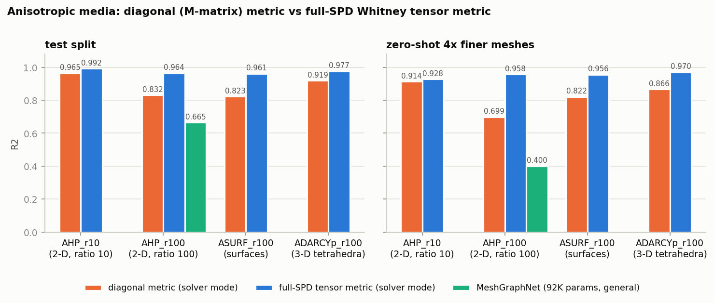

### 1.2 Transfer across meshes and resolutions

The v1 metric has `n_k x 8` free parameters per mesh, so a model with this metric cannot be evaluated on another mesh.
The v2 metrics are functions of E(n)-invariant local descriptors (`log(x / median)` per complex), the operators are
normalised per sample, and the network is exactly invariant to the length unit.

| model | evaluation | R2 |
|---|---|---:|
| T6f (edge connection to face flux), trained on one 1024-vertex mesh | training mesh, test split | 1.0000† |
| | new random mesh (seed 7) / (seed 11) | 0.9961† / 0.9999† |
| | 4x finer new mesh (4096 vertices) / 4x coarser (256) | 0.9999† / 0.9997† |
| HP_k100 solver mode, learned tensor metric (2,355 parameters) | test / zero-shot 4x resolution | 0.9999 / 1.0000 |
| HP_k100 MeshGraphNet, v2 budget (92K) / v1 budget (452K) | test / zero-shot 4x resolution | 0.9488 / 0.2581, 0.9269 / 0.4345 |
| HP_k100 v2 general stack (polynomial, 100 epochs / resolvent, 50 epochs) | test / zero-shot 4x resolution | 0.8255 / 0.6992, 0.9082 / 0.6812 |
| SURF (screened Poisson on variable closed surfaces) | test / superquadrics / genus-2 surfaces | 0.9967 / 0.9965 / 0.9964 |

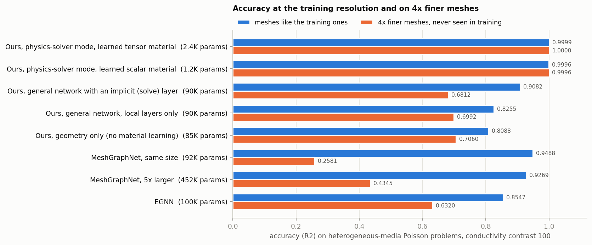

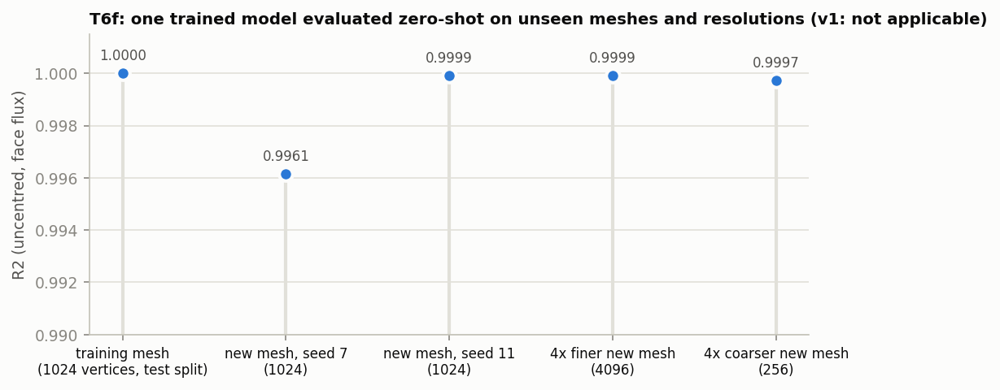

### 1.3 Exact structure

`d_{k+1} d_k = 0` is exact (integer incidence) for triangle, polygon, tetrahedral and grid complexes and for
block-diagonal batches; every learned operator is bounded, `||L|| <= 1`, for every sample and metric.  The network is
exactly equivariant under channel-frame rotations O(C), invariant under E(n) (vector readouts equivariant), vertex
relabelling and face-orientation changes, invariant under Abelian gauge transformations `theta -> theta + d_0 lambda` in
connection mode, and independent of the other samples in a batch.  On trained models (300 test samples) these
transformations change R2 by at most 3.4e-9 (T6f), 9.0e-10 (T3) and 8.6e-11 (HP_k100 in solver mode), that is, by
round-off (section 5).  Constraint readouts hold exactly: `grad` (`E = d_0 phi`, curl-free), `curl` (`F = d_1 a`,
closed, gauge invariant), `div` (co-closed, zero sum per mesh) and `mdiv` (mass-weighted divergence:
`sum_i star0_i y_i = 0` per mesh, exactly conservative density increments).  1771 tests pass on CPU and CUDA
(section 5).

### 1.4 Physical inversion: the metric is the material, if the architecture solves with it

With `material_dims`, the material columns (log conductivities) reach only the metric heads, never the features or
gates.  In solver mode the model is linear in the field inputs and its only layer solves with the un-normalised
metric Hodge Laplacian; for P1 data this model class contains the exact discrete solution operator.  On HP_k100
(isotropic log-normal conductivity, contrast 100):

* the learned per-face tensors equal the true conductivity **in physical units**: face `log det(sigma_f)/2` vs
  `log sigma_f`: r = 0.996, slope 1.039, intercept 0.005 (per-sample intercept spread 0.006); edge action
  `log mean_f t_e^T sigma_f t_e` vs edge `log sigma`: r = 0.993; median anisotropy ratio 1.19 on isotropic data;
  test R2 0.9999 and 4x R2 1.0000 with 2,355 parameters;
* a learned diagonal metric recovers the edge conductances with r = 0.998, slope 0.985 (test R2 0.9996), since the
  HP meshes almost satisfy the M-matrix condition;
* freezing the metric at the true material reproduces the FEM solution without any training (R2 0.99999999, verified by
  `tests/test_numerics.py::test_trainer_solver_frozen_tensor_faceref_reproduces_real_hp`); the frozen controls reach
  1.0000 / 1.0000 with 46 parameters.

In the general stack, where the material also enters features and gates, accurate models learn metrics that are not the
material: |r| <= 0.27 per layer for diagonal HP_k100 runs, up to 0.76 with mostly negative signs for tensor runs, and
spurious anisotropy on isotropic data (median eigenvalue ratio up to 10 in some layers).  The feature route and the
metric route are interchangeable for an MSE loss, and polynomial layers prefer preconditioner-like metrics
(section 2.6).

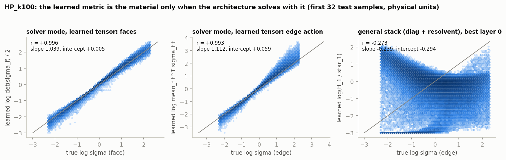

On anisotropic data the tensor-metric solver recovers the edge action (r = 0.86-0.93) but not the per-face tensor itself
(face `log det` r 0.41-0.74; median anisotropy ratio 157 vs 93 true on AHP_r100), as the identifiability analysis
predicts: a scalar Poisson operator sees a face tensor only through its action on the edges.  Principal directions are
recovered well, but eigenvalue ratios are overestimated: on the plotted AHP_r100 test mesh the median direction error is
8.9 degrees (45 for random directions) and the median learned ratio is 186 vs 97 true
(`results/anisotropy/AHP_r100_tensor-solver_lr3e-4_s42/fig4_direction_stats.json`).

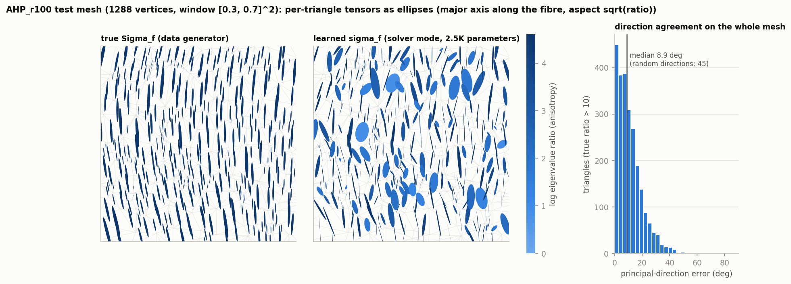

## 2. What the library computes

### 2.1 Complexes, stars and invariant geometry

`CochainComplex` stores the coboundaries `d_k` as oriented incidence matrices (CSR, with separately built transposes and
absolute values) for triangle meshes (planar or surfaces in 3-D), polygon (CW) meshes, tetrahedral meshes, grids and
block-diagonal batches of any of them.  Reference Hodge stars are computed once per complex in float64 from intrinsic
quantities: the cotan star (default on triangles, clamped at `1e-2 * median`), barycentric stars (polygons, tetrahedra)
or unit stars (ablation).  Per-cell descriptors (log lengths, areas, volumes, angles, boundary flags, dihedral angles,
relative to the median of the complex) are E(n)-invariant and scale-free.  Inputs of degree k are `(n_k, B, F_k)`
tensors with columns `[connection | odd | even]`: odd columns are cochains (they flip with the cell orientation), even
columns are coefficients.

### 2.2 Metrics: DEC stars times a bounded learned correction

The learned metric of degree `m` is `H_m = star_m * exp(ref_m) * exp(a * tanh(MLP_m(psi_m)))`, where `psi_m` contains
only O(C)- and E(n)-invariant quantities (norms and inner products of the features, the descriptors, even inputs),
`ref_m` is the optional metric reference (a known material coefficient in physical log units, `metric_reference`) and
`a` bounds the correction.  The last layer of every metric head is zero-initialised, so the model starts as the pure DEC
operator of the mesh; `learn_metric=False` keeps it there (the `dec_fixed` control).

### 2.3 Normalised Hodge blocks and the message-passing layer

For degree `k`, the up block uses `A = d_k`, `H = H_{k+1}`; the down block `A = d_{k-1}^T`, `H = H_{k-1}^{-1}`.  In the
symmetrised DEC frame (`s = star_k^{-1/2}` for up blocks, `star_k^{1/2}` for down blocks)

```
L z = s A^T (H / beta) A (s z),      T y = s A^T sqrt(H / beta) y,      beta = max_j s_j [ |A|^T (H |A| s) ]_j
```

`beta` is the per-sample Gershgorin bound of `s A^T H A s`, hence `0 <= L`, `lambda_max(L) <= 1`, `L = T T^T` and
`||T|| <= 1` for every sample and every `H > 0`.  A polynomial layer updates every degree with
`m_k = sum_p c_p L_up^p x_k + sum_p c'_p L_dn^p x_k + w T_up x_{k+1} + w' T_dn x_{k-1}` (scalar coefficients) followed
by the radial gate `x_k <- x_k + gamma sigmoid(MLP(log(1 + r))) m_k / r` with `r = rms(m_k)`: the update is the message
times a positive O(C)-invariant scalar, so the stack is O(C)-equivariant.  The lifting is strictly odd on degrees
k >= 1 (odd linear map times an even gate), which gives relabelling and orientation equivariance; connection columns
enter only through `d A`, which gives exact gauge invariance.

### 2.4 The Whitney tensor metric and what it can represent

With `metric_type='tensor'`, each top cell carries `sigma_f = b_f expm(sum_j s_j t_j t_j^T)` (`t_j` its unit edge
vectors, `s_j` signed and bounded, `b_f > 0`), which covers every SPD tensor of bounded condition number.  The metric is
the Galerkin star `(H_k)_{e e'} = sum_f int_f w_e . sigma_f w_{e'}` of the Whitney k-forms, assembled from float64
element matrices; at initialisation (`sigma_f = I`) `d_0^T H_1 d_0` is exactly the P1 stiffness matrix (the unclamped
cotan Laplacian) and, on tetrahedra, `d_1^T H_2 d_1` is the Nedelec curl-curl matrix.  Up blocks use the tensor metric
("consistent up, lumped down"); a blockwise row-sum bound keeps `||L|| <= 1`.  The alternative cone parameterisation
`b I + sum_j a_j t_j t_j^T` with `a >= 0` (available as `tensor_param='cone'`) generates only M-matrices, the class of
the diagonal metric; on the anisotropy sets it covers 20 % / 2.6 % of the triangles at ratio 10 / 100 and 1 % / 0 % of
the tetrahedra.

Representability statements ([docs/THEORY.md](docs/THEORY.md)): (i) P1 elements with an SPD tensor coefficient are
exactly a metric Hodge operator `d_0^T H_1^W(sigma) d_0`; (ii) a positive diagonal `H_1` represents a P1 stiffness
matrix iff all edge weights are positive (M-matrix); (iii) Whitney mass matrices of 1- and 2-forms couple the edges
(faces) of every cell, which no diagonal metric can express, so curl-curl and Darcy face-flux operators with tensor
coefficients are outside the diagonal family altogether.

### 2.5 Resolvent layers, solve layers and solver mode

A resolvent layer replaces the polynomial self term by `(I + tau_up L_up + tau_dn L_dn)^{-1} x` (learned
`tau <= 100`), a discrete Green's function of the learned metric with condition number `<= 1 + tau`.  A solve layer
computes `y = (Delta_H + lambda / L^2)^{-1} x` with the un-normalised metric Hodge Laplacian in physical units (FEM
stiffness over lumped mass for k = 0), Dirichlet or Neumann handling and a small learned shift.  Both are batched
conjugate gradients with per-sample (per-graph) Frobenius inner products, so they are O(C)-equivariant and
batch-independent, with exact implicit (adjoint) gradients and warm starts; the solve layer has a two-level
preconditioner (Jacobi plus a coarse correction on about 32-vertex aggregates) that cuts the residual after 64
iterations about 1000-fold on HP-size meshes.  *Solver mode* (`RHMPConfig.solver_preset`, trainer `--solver-mode`) is
a linear lifting, one solve layer and a linear readout initialised by least squares; with `material_dims` the only
path from the material to the output is the metric.

### 2.6 What is identifiable

* Edge conductances are identifiable from the operator `d_0^T diag(w) d_0` (edges correspond one-to-one to
  off-diagonal entries); per-face tensors are not: the map from `{sigma_f}` (3 unknowns per triangle) to edge weights
  (about 1.5 per triangle) has a large kernel, so tensors are identifiable only through their edge action, unless a
  shared network maps material inputs to tensors.
* From data pairs `(f, u)`, the diagonal case is linear in `w` (`d_0^T diag(w) d_0 u = M f`): a few generic samples
  determine the material by a convex least-squares problem, the operator-identification loss `--aux-pde`.
* The normalised operator is invariant under `H -> c H` per sample, so the magnitude of the material is not
  identifiable from normalised layers; solve layers work in physical units.
* Why general stacks do not learn the material: (i) route redundancy (material in features and metric; MSE does not
  prefer the metric route); (ii) a degree-P polynomial layer approximates an inverse operator, for which a
  preconditioner-like metric (`h ~ 1 / sigma`) is better than `sigma`; (iii) no layer solves.

### 2.7 DEC toolkit

`rhmp.dec` exposes the same operators directly: metric Hodge Laplacians (weak and strong forms), Hodge decomposition
and harmonic bases (Betti numbers verified on tori, spheres, disks and cubes), batched CG with unrolled or implicit
gradients, Whitney metrics, and Whitney `sharp` / de Rham `flat`.  The mathematics of every operator, with the tests
that check it, is in [docs/MATH.md](docs/MATH.md).

## 3. Engineering

Defects of the paper code (v1) and their fixes:

| # | v1 defect | effect | v2 fix |
|---|---|---|---|
| F1 | metric = per-cell free parameters (`n_k x 8` bases) modulated by a global mean | no transfer across meshes or resolutions; depends on cell numbering; no geometric meaning | DEC reference star x bounded correction from local invariants; no per-cell parameters |
| F2 | metric computed from the batch mean | predictions depend on the batch (4e-4 relative at 1K cells, 7e-3 at 100K) | per-sample metrics, batch-independent (tested to 1e-6) |
| F3 | unbounded metric, un-normalised operators, LayerNorm (breaks O(C)) | deep stacks unstable, conditioning uncontrolled | bounded log-metric, per-sample Gershgorin normalisation `||L|| <= 1`, scalar-gain RMS and radial gate |
| F4 | `local_rich` metric uses absolute coordinates | breaks E(n); 2-D only | invariant geometry only; 2-D and 3-D |
| F5 | 1-cochain lifting `sym + asym` (not odd) | not invariant to vertex relabelling | strictly odd lifting (odd linear x even gate) |
| F6 | inputs only at vertices; edge fields hand-encoded as `(avg, avg dx, avg dy)` | cochain structure lost | native inputs / outputs on any degree; exact gauge-invariant connection mode |
| F7 | `d_1 d_0 = 0` checked by densifying an `n_2 x n_0` matrix | 20 GB and 6.5 s at 100K faces; 1M infeasible | sparse check: 8 ms at 100K faces |
| F8 | COO products with `.t()` / `.coalesce()` per call, recomputed geometry, permute copies | T6 step 105 ms / 7.2 GB | CSR with cached transposes, `(n, B, C)` zero-copy layout, cached geometry, fused kernels, block-diagonal variable-mesh batches |
| F9 | triangles and degrees 0-2 only | no volume meshes, no general CW complexes | triangles, polygons, quads, tetrahedra, grids; degrees 0-3 |

Training step, inference and peak memory on an exclusive GPU ([bench/RESULTS_step.md](bench/RESULTS_step.md)):

| setting | v1 train step | v2 train step | v1 inference | v2 inference | v1 peak | v2 peak |
|---|---:|---:|---:|---:|---:|---:|
| T6 (n0 = 1024, C = 128, 4 layers, batch 64) | 104.3 ms | 63.4 ms | 50.7 ms | 17.6 ms | 7.16 GB | 4.27 GB |
| T7 (C = 160) | 139.3 ms | 80.2 ms | 67.7 ms | 24.2 ms | 8.91 GB | 5.31 GB |
| T6_100K (C = 16, 3 layers, batch 2) | 23.8 ms | 19.5 ms | 11.3 ms | 5.7 ms | 1.72 GB | 1.13 GB |
| 1M-triangle mesh (C = 16, 4 layers) | infeasible | 131 ms | - | 38 ms | - | 8.06 GB (AMP + checkpointing: 3.84 GB) |

* Complex construction: 100K faces 4.4 s (v1, CPU, dense check) vs 8 ms (v2, GPU); 1M faces 16 ms.
* Sparse products: CSR with the precomputed-transpose backward is the fastest method in every regime, 2.8-6.1x faster in
  forward+backward than the v1 `batch_spmm` ([bench/RESULTS_ops.md](bench/RESULTS_ops.md)).
* Variable meshes: block-diagonal batches of 8 meshes train 6.2x (T8) and 7.0-7.9x (HP) faster than a per-mesh loop,
  12-14x with 16 HP meshes, 3.6x on tetrahedra.
* Tensor metric: tensor vs diagonal up block (forward + backward) 3.5 vs 0.73 ms at T6 size; a 16-iteration CG
  resolvent with the tensor up block 27 ms; a two-level solve layer 0.42 s per step on 8 HP meshes.
* Baselines on T6 (batch 64, exclusive GPU): v2 60.5 ms per step, MeshGraphNet 29.8 ms (MeshGraphNet-8, `mgn_fast`, with
  AMP: 19.4 ms), GAT 15.8 ms, CW Net 6.8 ms, the v1 model 104.9 ms.

## 4. Scope of the task suite

| family | what it is | what it tests |
|---|---|---|
| paper tasks T1-T8 | v1 datasets (vorticity, torus transport, ellipsoid flow, electrostatics, U(1) and SU(2) gauge fields, airfoil pressure); native (cochain) and legacy (v1) inputs | comparison with the paper; the pseudo-scalar finding |
| T1q, T6f, T7f | quad CW complex; face-cochain targets of T6/T7 | general complexes; native targets |
| HP, HPflux, HPgrad, HP_k<kappa>, HP_aniso | heterogeneous / anisotropic Poisson on variable random meshes, contrast 10-10000, zero-shot 4x-resolution test sets | material, conditioning, variable meshes, resolution transfer |
| TET, TETflux | 3-D Poisson on random tetrahedral meshes | degree-3 complexes, face fluxes |
| SURF, SURF_heat | screened Poisson / heat flow on 5700 variable closed surfaces; geometry and topology (genus 2) transfer | intrinsic geometry, topology transfer |
| DYN, DYNfix | advection-diffusion with a velocity 1-form, 100-step rollouts | cochain inputs, rollout stability, conservation |
| HP_qual | HP models on graded and sliver meshes | mesh-quality robustness |
| AHP, ASURF, ACURL, ADARCY | misaligned anisotropic tensors (ratio 10 / 100): 2-D P1, surface fibre diffusion, 3-D Nedelec curl-curl, 3-D RT0 Darcy | where the diagonal metric provably fails |

All targets are exact sparse FEM / DEC / FEEC solves ([docs/TASK_SUITE.md](docs/TASK_SUITE.md),
[docs/TASK_SUITE_DETAILS.md](docs/TASK_SUITE_DETAILS.md), [docs/ANISO_TASKS.md](docs/ANISO_TASKS.md),
[datasets/README.md](datasets/README.md)).

## 5. Correctness

**Tests.**  On a machine with a CUDA GPU, the suite (`python3 -m pytest tests -q`, CPU and CUDA) gives 1771 passed, 49
skipped (inapplicable model / fixture pairs, CPU-only branches), 1 expected failure (`torch.compile` with Inductor needs
the Python headers) and 0 failed.  The suite checks `d^2 = 0` for every builder and batch; O(C) equivariance of the
whole stack (1e-5 fp32, 1e-10 fp64); E(n) invariance and equivariance; vertex relabelling; orientation flips; batch
independence (1e-6); gauge invariance; `||L||, ||T|| <= 1` against dense eigenvalues; finite outputs on sliver meshes
(aspect 1e4) and extreme inputs; fp32 vs fp64; fused kernels vs reference; checkpoint round trips; the DEC identities;
the exact FEM reproduction of solver mode; agreement of the metrics with the v1 evaluation code (1e-6); the
re-evaluation of v1 checkpoints against the paper (1e-5); and the examples, the README quickstart and the tutorial code.

**Symmetries of trained models** (300 test samples; dR2 = change of R2; `scripts/eval_robustness.py RUN --all`):

| model | base R2 | batch 1 vs 64 | relabel | flip orientation | rotate | reflect | gauge 0.1 / 1 / 10 | input noise 0.01 / 0.1 |
|---|---:|---:|---:|---:|---:|---:|---:|---:|
| T6f | 0.999992† | -3.5e-11 | -3.4e-09 | -3.4e-09 | -3.4e-09 | -3.4e-09 | +7.2e-12 / +1.3e-11 / -3.2e-10 | -0.006 / -0.584 |
| T3 | 0.995933 | +9.0e-10 | +5.4e-10 | +1.1e-11 | +1.4e-10 | - | - | -0.395 / -5.51 |
| HP_k100 solver, tensor | 0.999948 | -2.4e-12 | +1.2e-11 | -8.6e-11 | +7.6e-11 | +2.9e-11 | - | -8.5e-07 / -9.9e-05 |

Exact derivative maps (T6f: connection to curvature; T3) amplify input noise, as the physics does; the solver-mode model
is insensitive to it.  T7f (SU(2)) uses the non-Abelian connection path, where exact gauge invariance is given up by
design (dR2 -0.38 at gauge noise 10).

## 6. Experiments

### 6.1 Paper tasks (v1 protocol, test100 R2)

| task | v1 (re-evaluated) | v2 native | v2 legacy | notes |
|---|---:|---:|---:|---|
| T1 vorticity | 0.918 | 0.893 (+ latent 0.890) | 0.281 | quad CW complex T1q: **0.924** |
| T2 torus transport | 0.913 | 0.685; **0.890** with latent 1:8 | = native | the data hide a fixed velocity field; latent edge columns make the per-cell parameters explicit |
| T3 ellipsoid flow | 0.971 | **0.996** | 0.926 | least-squares vector readout at its round-trip ceiling |
| T5 electrostatics | 0.676 | 0.554; T5g + resolvent 0.600; **T5g solver mode 1.000** (frozen and learned tensor; learned diagonal 0.464) | 0.685 | target = the v1 edge-to-node average of `-d_0 phi`; the generator has negative-weight edges, so only a tensor metric represents it |
| T6 Wilson loop | 0.955 | **1.000** | 0.862 | T6f: 1.000† |
| T7 Yang-Mills SU(2) | 0.653 | **0.879** | 0.3935 | T7f: 0.943† |
| T8 airfoil pressure | 0.602 | 0.470 (T8v 0.458; + resolvent 0.431) | = native | v1 uses absolute-coordinate features, and its checkpoint is selected on the test split; v2 is strictly E(n)-invariant |

*v1 (re-evaluated)*: the paper's v1 checkpoints evaluated with the same split and metric code
(`python -m rhmp.train --eval-v1`); they reproduce the paper's numbers.

**The pseudo-scalar finding.**  The v1 targets of T1 (vorticity at vertices), T6/T7 (plaquette flux averaged to
vertices) and T3 (`n x grad psi`) change sign under a change of the face-orientation convention or under reflections.  A
model that is exactly equivariant to orientation relabelling and invariant to reflections cannot output them from native
cochain inputs: on T6, reversing half of the faces changes the v2 vertex output by a relative 3e-6, that is, by
round-off.  v1 fits them because its per-cell parameters memorise the mesh frame.  v2 predicts the field on its true
cochain (edge connection, face flux) and applies a fixed, parameter-free orientation map (oriented face-to-vertex mean
for T1/T6/T7, `n x g` for T3), which reproduces the v1 targets exactly (7e-8).  The v1 tables of MPSN, SCCNN and
Clifford-SMPN report *edge-space* R2 (edge-averaged targets scored on edges), which is not comparable with vertex R2.

### 6.2 New tasks and the extension suite (100 epochs)

| task | test R2 | zero-shot / transfer R2 | note |
|---|---:|---:|---|
| T1q (quad CW complex) | 0.907 (test100 0.924) | - | |
| T6f (edge connection to face flux) | **1.0000**† | new meshes 0.9961-0.9999 | |
| T7f (SU(2), edge to face) | 0.944† | - | |
| HP_k10 / HP_k100 / HP_k1000 | 0.899 / 0.8255 / 0.787 | 4x: 0.789 / 0.6992 / 0.659 | solver mode on HP_k100: 0.9996-0.9999 / 0.9996-1.0000 |
| HP_k1000 / HP_k10000 (diagonal, polynomial, 50 epochs) | 0.778 / 0.754 | 4x: 0.691 / - | |
| SURF (variable closed surfaces) | **0.9967** | superquadrics 0.9965, genus 2 0.9964 | MeshGraphNet is as good (section 6.5) |
| SURF_heat | 0.9966 | 0.9962 / 0.9960 | |
| DYN / DYNfix (one step) | 0.9997 / 0.9997 | rollouts: section 6.7 | |
| TET_k100 (3-D, polynomial 100 epochs) | 0.975 | 4x: 0.589 | resolvent (50 epochs): 0.983 / 0.482 |
| TETflux_k100 (face flux 2-cochain) | 0.876† | 4x: 0.545† | |
| HPflux_k100 (edge flux 1-cochain) | 0.573† | 4x: 0.354† | the flux halves under refinement while the model is scale-free; HPfluxd: 0.581† / 0.453† |
| ACURLb_r10 (3-D Nedelec curl-curl, face target, general stack, 1500 samples) | diagonal 0.548†, tensor 0.585† | 4x: 0.370† / 0.393† | needs a 1-form solve layer (the solve layer handles 0-forms only) |

### 6.3 Metric and layer variants (HP_k100; general stack 50 epochs, solver mode 30)

| variant | test R2 | 4x R2 | params | note |
|---|---:|---:|---:|---|
| diagonal + polynomial (default) | 0.802 | 0.692 | 90K | |
| tensor (cone) + polynomial | 0.819 | 0.6985 | 95K | |
| tensor (full SPD) + polynomial | 0.822 | 0.710 | 95K | |
| diagonal + resolvent | 0.908 | 0.681 | 90K | |
| tensor (cone) + resolvent | 0.914 | 0.654 | 93K | learned `tau` couples to the mesh scale |
| solver mode, frozen tensor metric + face sigma reference | **1.0000** | **1.0000** | 46 | the architecture is the exact P1 FEEC solver |
| solver mode, frozen diagonal metric + edge sigma reference | 1.0000 | 1.0000 | 46 | the DEC two-point star is exact here too |
| **solver mode, learned tensor metric (material only in the metric)** | **0.9999** | **1.0000** | 2.4K | the metric must become the material |
| solver mode, learned diagonal metric | 0.9996 | 0.9996 | 1.2K | edge conductance r = 0.998, slope 0.985 |
| material-only routing + resolvent (general stack) | 0.882 | 0.739 | 90K | per-layer r -0.38 / +0.69 / +0.09 / +0.25 |
| auxiliary PDE-residual loss (weight 1.0) + resolvent (general stack) | 0.805 | 0.696 | 90K | the resolvent layer's metric is the material: r = 0.985, slope 0.986 |
| material-only routing + edge reference + resolvent | 0.782 | 0.718 | 90K | per-layer r 0.49 / 0.77 / 0.90 / 0.77 |
| frozen diagonal metric + true edge reference + resolvent | 0.792 | 0.716 | 85K | forcing the material into a general stack costs accuracy |
| pure DEC (frozen, no reference) + resolvent | 0.797 | 0.716 | 85K | the +0.11 of the learned metric is a free metric, not the material |
| HP_k1000 diagonal + polynomial: with / without metric reference | 0.786 / 0.778 | 0.714 / 0.691 | 90K | the reference helps little in the general stack |
| HP_k100_aniso100: diag poly / diag resolvent / tensor poly / tensor resolvent (full) | 0.759 / 0.849 / 0.7445 / 0.839 | 0.627 / 0.642 / 0.642 / 0.543 | | no tensor gain in the general stack |

**Metric recovery** (learned vs true log conductivity, physical units, first 32 test samples;
[results/RESULTS.md](results/RESULTS.md) section 4 has every layer):

| run | per-layer r (edge) | best slope / intercept | face r (tensor) | face slope / intercept |
|---|---|---|---|---|
| solver, learned tensor | +0.993 (action) | 1.112 / +0.059 | +0.996 | 1.039 / +0.005 |
| solver, learned diagonal | +0.998 | 0.985 / +0.070 | - | - |
| solver, frozen FEM control | +1.000 | 0.999 / +0.001 | +1.000 | 1.000 / +0.000 |
| general, diagonal + polynomial | +0.053 / -0.022 / -0.142 / +0.034 | -0.207 / -0.140 | - | - |
| general, diagonal + resolvent | -0.273 / +0.224 / +0.012 / +0.158 | -0.239 / -0.294 | - | - |
| general, tensor (full) + polynomial | -0.151 / -0.200 / +0.025 / -0.691 | -2.315 / -3.775 | -0.197 / -0.276 / +0.108 / -0.730 | -2.242 / -4.266 |
| general, aux PDE loss + resolvent | -0.351 / -0.723 / -0.107 / +0.985 | 0.986 / -0.068 | - | - |

### 6.4 Anisotropy family

Oracle representability: relative L2 solution error when the true tensors are replaced by the best member of each
metric family (ratio 100; 12 test samples):

| task | diagonal star | cone tensor | full tensor (bound 5) |
|---|---:|---:|---:|
| AHP r100 (u) | 0.44 | 0.45 | **0.06** |
| ACURL r100 (A / B) | 0.85 / 0.91 | 0.82 / 0.85 | **0.06 / 0.14** |
| ADARCY r100 (face flux) | 0.76 | 0.64 | **0.09** |

Training results (solver mode unless stated otherwise):

* AHP_r100: diagonal 0.832 / 0.699; tensor 0.919 / 0.741 at lr 1e-3 (best epoch 3, oscillating afterwards),
  **0.964 / 0.958** at lr 3e-4 for 60 epochs.  General stack with the metric reference: diagonal 0.593 / 0.449, tensor
  0.530 / 0.432; MeshGraphNet 0.665 / 0.400.
* AHP_r10: diagonal 0.965 / 0.914, tensor **0.992 / 0.928**.
* ASURF_r100 (surfaces): solver diagonal 0.823 / 0.822, tensor **0.961 / 0.956** (per surface family 0.951-0.967);
  general stack with the metric reference: diagonal 0.897 / 0.783, tensor 0.906 / 0.793, frozen DEC star (`dec_fixed`)
  0.918 / 0.807, so in the general stack the learned metric is no better than the frozen prior.
* ADARCYp_r100 (3-D Darcy pressure, 1500 samples): diagonal 0.919 / 0.866, tensor **0.977 / 0.970** (3.8K
  parameters).
* ACURLb_r10 (3-D curl-curl, general stack): diagonal 0.548† / 0.370†, tensor 0.585† / 0.393†; both are weak, because
  this problem needs a 1-form solve layer.
* Metric recovery: diagonal edge conductance r = 0.918 (AHP_r100), 0.962 (AHP_r10); tensor edge action r = 0.86-0.93,
  face log det r = 0.41-0.74, median anisotropy ratio 157 (lr 3e-4) / 49 (lr 1e-3) vs 93 true at ratio 100 and 11 vs 9.4
  at ratio 10: the action is recovered, but the per-face tensor is not identifiable from a scalar Poisson operator.  In
  3-D at ratio 100 the inputs cannot determine the tensors (6 entries per tetrahedron vs about 1.3 edges per
  tetrahedron; oracle reconstruction error 52 %).

### 6.5 Baselines (common trainer, v1 protocol, 100 epochs)

The v2 budget matches the parameter count of the v2 model (about 90K; 0.31M on T8); the v1 budget is about 0.43M.  The
table reports R2 on the full test split (MPSN, SCCNN and Clifford-SMPN on T3/T6 with the v1 edge protocol); "paper"
marks the numbers of the v1 paper.

| model | T6 legacy (v2 / v1 budget) | T6 paper | T3 legacy | HP_k100 test / 4x (v2 budget) | HP_k100 test / 4x (v1 budget) | SURF test / geo / topo | T8 test |
|---|---:|---:|---:|---:|---:|---:|---:|
| RHMP v2 | 0.866 (native 1.000) | 0.955 (v1) | 0.926 (native 0.996) | solver 0.9999 / 1.0000; general 0.8255 / 0.6992 | - | 0.9967 / 0.9965 / 0.9964 | 0.5101 (v1 checkpoint: 0.6219; paper 0.602) |
| GEM-CNN | 0.989 / - | 0.517 | 0.954 | 0.841 / 0.627 | - | 0.9881 / 0.9877 / 0.9843 | **0.6950** |
| GaugeEquivCNN | 0.965 / 0.987 | 0.783 | 0.956 | 0.756 / 0.693 | - | 0.9759 / 0.9757 / 0.9718 | 0.5815 |
| MeshGraphNet | native 0.973 / 0.986 | - | native 0.989 | 0.9488 / 0.2581 | 0.9269 / 0.4345 | **0.9997 / 0.9996 / 0.9995** | 0.6527 |
| SchNet | 0.872 / 0.949 | 0.474 | -0.001 | 0.782 / 0.688 | 0.781 / 0.687 | 0.9854 / 0.9862 / 0.9812 | 0.3117 (paper 0.380) |
| CW Net | 0.861 / 0.941 | 0.875 | 0.406 | 0.801 / 0.661 | 0.804 / 0.658 | 0.9815 / 0.9828 / 0.9754 | 0.3949 |
| EGNN | 0.759 / 0.841 | 0.752 | -0.001 | 0.855 / 0.632 | 0.825 / 0.661 | 0.9930 / 0.9950 / 0.9877 | 0.3725 (paper 0.347) |
| GAT | 0.513 / 0.636 | 0.703 | -0.001 | 0.682 / 0.623 | 0.697 / 0.634 | 0.9739 / 0.9736 / 0.9703 | 0.0145 (paper 0.048) |
| SCCNN | 0.356 | 0.527 | 0.004 | 0.868 / 0.620 | - | 0.9908 / 0.9897 / 0.9876 | 0.1511 |
| MPSN | 0.186 | 0.183 | -0.001 | 0.792 / 0.684 | - | 0.9835 / 0.9829 / 0.9807 | 0.3270 |
| Clifford-SMPN | 0.593 | 0.765 | 0.010 | 0.790 / 0.662 | - | 0.9813 / 0.9825 / 0.9752 | 0.2877 |
| GCN | 0.034 | 0.059 | -0.001 | 0.684 / 0.672 | - | 0.9371 / 0.9379 / 0.9397 | 0.1877 (paper 0.266) |
| dec_fixed (v2, frozen DEC star) | native 1.000 | - | native 0.993 | 0.809 / 0.706 | - | 0.9933 / 0.9925 / 0.9926 | 0.4155 |

Reading the table:

* On the gauge tasks the native v2 model is exact (T6 1.000), and most node baselines improve substantially with the v1
  budget; GEM-CNN and GaugeEquivCNN, with the corrections listed in [docs/BASELINES.md](docs/BASELINES.md), are the
  strongest legacy-input baselines.
* HP_k100 separates in-distribution accuracy from physics: MeshGraphNet fits the training resolution well (0.949) but
  collapses on the 4x-resolution test set (0.258; 0.4345 with 5x more parameters), while the v2 solver-mode model keeps
  1.0000 with 2.4K parameters.  In the general stack, metric learning adds only +0.017 over the frozen DEC star (0.8255
  vs 0.8088); the gains come from the resolvent layer (0.908) and from solver mode (0.9999).
* **SURF is not discriminative.**  The screened Poisson problem is local enough that strong message passing also
  transfers without loss (MeshGraphNet 0.9997 / 0.9996 / 0.9995 vs v2 0.9967 / 0.9965 / 0.9964).
* **T8 is a v2 weakness.**  Gauge-equivariant CNNs, which encode relative positions in local frames, are strongest
  (GEM-CNN 0.6950); the strictly E(n)-invariant v2 model, which has no positional prior, reaches 0.5101, and the v1
  checkpoint 0.6219 (selected on the test split, with absolute-coordinate features).  MeshGraphNet has a large
  generalisation gap (validation 0.921, test 0.653).

### 6.6 Transfer and robustness

* T6f zero-shot to new meshes: seed 7 0.9961†, seed 11 0.9999†, 4096 vertices (4x finer) 0.9999†, 256 vertices
  (4x coarser) 0.9997† (`scripts/t6_mesh_transfer.py`).
* SURF: geometry transfer (ellipsoids, perturbed spheres, tori to superquadrics) 0.9965 and topology transfer (genus
  0 and 1 to genus 2) 0.9964, from 0.9967 in distribution.
* Mesh-quality shift of HP_k100 models (the 50-epoch model with a tensor metric and polynomial layers, with targets from
  4x-finer reference solutions): on the ladder of increasingly stretched sliver meshes the accuracy degrades smoothly
  from 0.837 (base) to 0.684 (stretch 6) and 0.619 (stretch 8).  Corner refinement lowers the node-uniform R2 (0.837 to
  0.339 at `corner_r64`) because the refined nodes sit where `u` is about 0; the mass-weighted relative L2 error, which
  measures the field, grows less (pooled, from 0.396 to 0.650; for a model trained for only 2 epochs, from 0.534 to
  0.739 while R2 drops from 0.705 to 0.381).
* Input noise: exact derivative maps (T6f, T3) amplify noise, as the physics does; T7f and T1q are more robust
  (section 5).

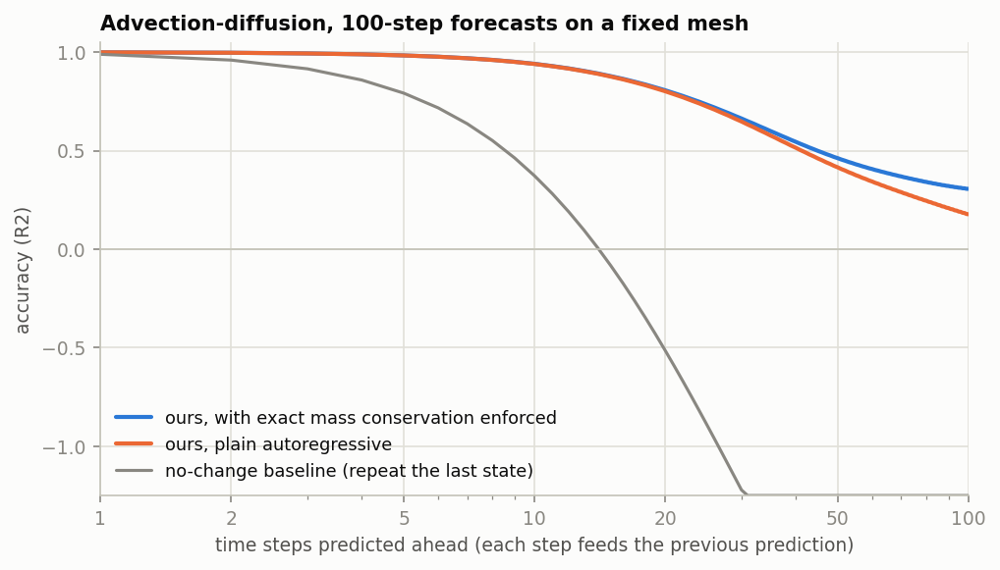

### 6.7 Autoregressive rollouts (DYN, DYNfix; 100 steps)

| model | R2 @ 1 / 5 / 10 / 25 / 50 / 100 | mass drift |
|---|---|---|
| DYNfix + per-step mass projection | 0.999 / 0.983 / 0.941 / 0.733 / 0.462 / 0.306 | 0 (9e-8 at step 100) |
| DYNfix, no projection | 0.999 / 0.983 / 0.940 / 0.723 / 0.415 / 0.177 | 0.26 at step 100 |
| persistence (`u_{t+k} = u_t`) | 0.989 / 0.792 / 0.373 / -0.89 / -2.13 / -3.24 | 0 |
| DYN (variable meshes), no projection | 0.999 / 0.966 / 0.889 / 0.219 / -3.76 / -20.4 | 5.13 at step 100 |
| DYN + per-step mass projection | 0.999 / 0.966 / 0.896 / 0.655 / 0.252 / -0.333 | 0 |
| DYNfix_cons (predict `du` through an exactly conservative flux map) | one-step R2 0.38; 0.994 at step 1, diverges (non-finite from step 14) | 0 until divergence |
| DYN_cons (mass-change convention: target `M du`) | 0.990 at step 1, non-finite from step 7 | |

Mass drift is the dominant long-horizon error: projecting the prediction back onto the conserved total mass after each
step keeps DYNfix above persistence at every horizon.  Conservation does not imply stability, however: the exactly
conservative `DYNfix_cons` parameterisation learns slowly (one-step R2 0.38) and its rollouts diverge; the advective
flux `theta_e (x_i + x_j) / 2` is an odd bilinear term that the lifting can build only indirectly.  The mass-change
convention (`DYN_cons`, loss on the mass change `M du`) diverges on meshes whose lumped masses differ 900:1, because
node-uniform errors in `M du` become `1/M` errors in `du`.

### 6.8 Qualitative comparisons

The figures of this section show the fields behind the numbers.  `scripts/make_field_figures.py` draws them from the
model-zoo checkpoints along the evaluation path of `rhmp.train --eval-ckpt` (with the normalisation of each run, raw
material columns and block-diagonal batches).  Every figure shows the first test sample of its task, not a selected one,
except figure 2, which shows the median case (see below).  The R2 in a panel title is the R2 of that one sample, centred
on its own mean; it is stricter than the pooled test R2 of the tables, whose total sum of squares also contains the
variation between samples, and figures 1 and 2 give the medians over the first 20 test samples for comparison.  The
per-panel numbers are in `results/field_figures/field_figures_stats.json`.

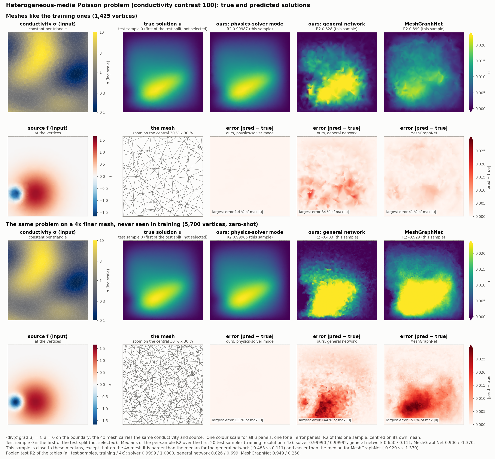

*Heterogeneous Poisson (HP_k100)*: on the training-resolution mesh and on the 4x finer one, the solver-mode model with a
learned tensor metric cannot be told apart from the FEM solution (R2 0.99987 / 0.99985 for this sample), while the
general stack (0.628 / -0.483) and MeshGraphNet (0.899 / -0.929) lose the shape of the solution on the finer mesh; the
medians over the first 20 test samples are 0.99990 / 0.99992, 0.650 / 0.111 and 0.906 / -1.370, so on the 4x mesh this
first sample is harder than the median for the general stack and easier for MeshGraphNet.

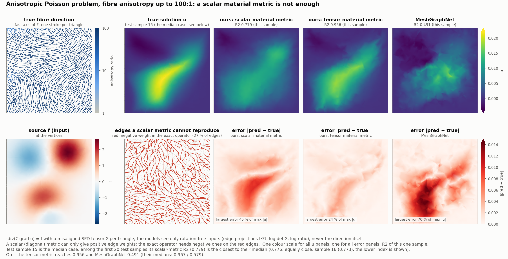

*Anisotropic Poisson (AHP_r100)*, the median case: among the first 20 test samples, whose diagonal-metric R2 has the
median 0.776, test sample 15 is the closest to the median, tied with sample 16 (0.773).  The exact operator needs
negative edge weights on 27 % of the interior edges, which a diagonal metric (the "scalar material metric" of the
figure) cannot produce; the diagonal-metric solver smears the ridge that the fibres draw out of the source (R2 0.779),
the tensor-metric solver follows it (0.956; its median 0.967), and MeshGraphNet reaches 0.491 (median 0.579).

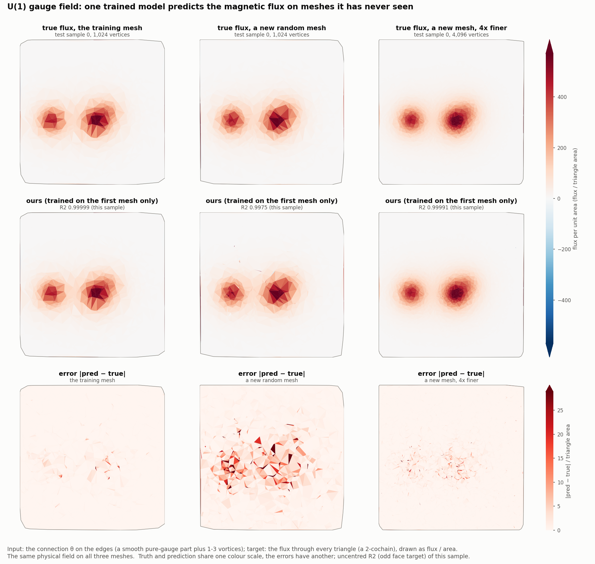

*U(1) gauge field (T6f)*: one physical field on the training mesh, a new random mesh and a 4x finer new mesh; the
model trained on the first mesh reproduces the face flux on all three (uncentred R2 0.99999 / 0.9975 / 0.99991), and
its errors on the new mesh sit in single triangles around the vortex cores.

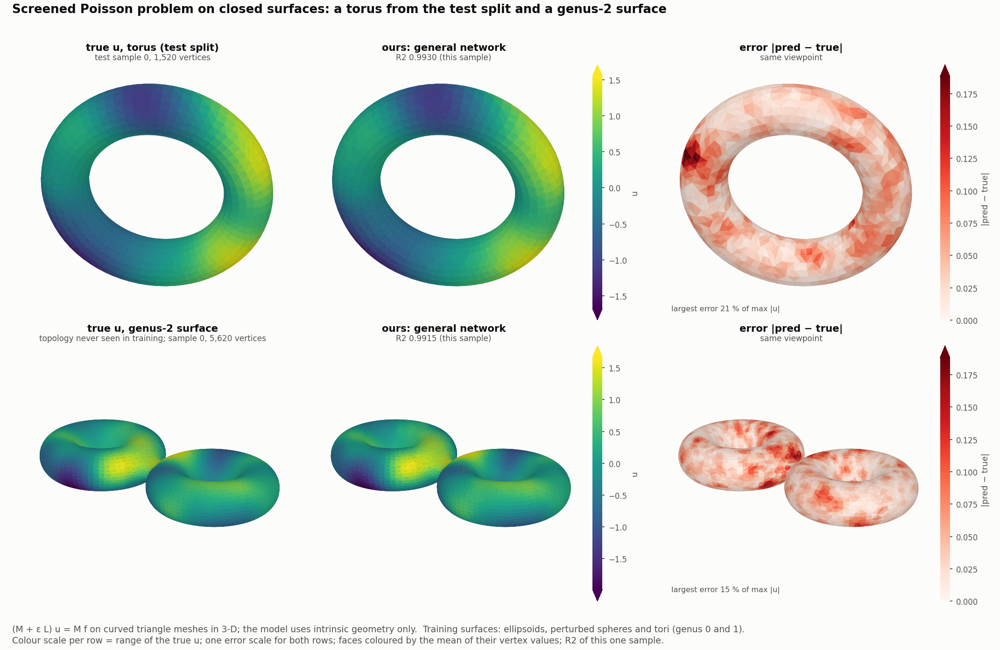

*Closed surfaces (SURF)*: a torus from the test split (R2 0.9930) and a genus-2 surface, a topology never seen in
training (0.9915); the errors on the genus-2 surface are of the same size as on the torus.

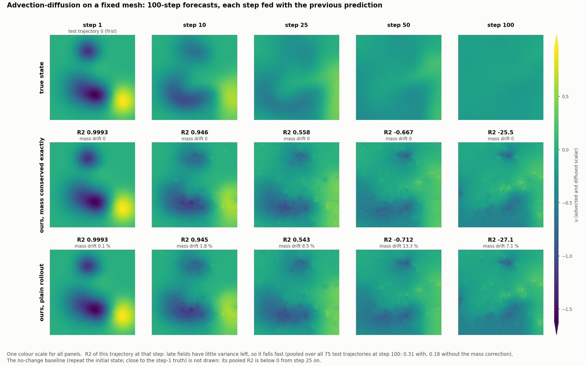

*Rollouts (DYNfix)*: the forecast follows the advected blobs for about ten steps (R2 0.946 at step 10 on this
trajectory), then keeps structure that the true field has already diffused away; the mass projection removes the
drift of the mean (up to 13 % without it) but not this pattern error.

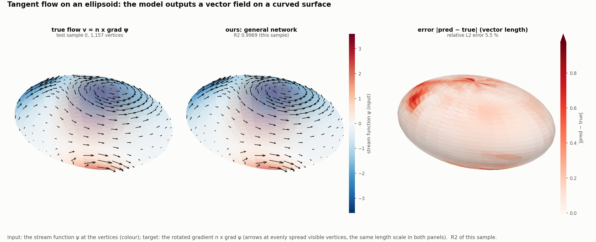

*Tangent flow on an ellipsoid (T3)*: the predicted vector field matches the true one to a relative L2 error of 5.5 %
(R2 0.9969), with the largest errors in two small regions of the surface.

## 7. Model zoo

[results/checkpoints/](results/checkpoints) contains fifteen trained models (4.0 MB in total; `best.pt`, `config.json`
and `result.json` each): HP_k100 in solver mode with a learned tensor, learned diagonal or frozen FEM metric, the
AHP_r100 tensor-metric (lr 3e-4) and diagonal-metric solvers, the ASURF_r100 and T5g tensor-metric solvers, T6f, T6
(native), T3 (native), SURF and DYNfix, and the comparison runs of section 6.8 (the general-stack HP_k100 model and
MeshGraphNet on HP_k100 and AHP_r100).  `RHMP.from_checkpoint(".../best.pt")` rebuilds a v2 model, and
`rhmp.baselines.registry.from_checkpoint` rebuilds the MeshGraphNet baselines;
`python -m rhmp.train --task <task> --eval-ckpt results/checkpoints/<run>` re-evaluates a checkpoint on its data (the
zoo DYNfix checkpoint reproduces its stored rollout to the last digit).

## 8. Negative results and open problems

* **T8.**  v2 (0.510 test) is below the v1 checkpoint (0.622, selected on the test split with absolute-coordinate
  features) and below GEM-CNN (0.695); the inflow 1-form (T8v 0.504), an absolute scale column (0.495) and a resolvent
  layer (0.482) do not help.  A strictly invariant model has no positional prior; gauge-equivariant local frames are the
  natural next step.
* **SURF is non-discriminative** (MeshGraphNet 0.9997 vs v2 0.9967; both transfer without loss).
* **Tetrahedral tensor metrics** keep the Whitney blocks of every complex in host memory: about 137 GB for the
  3000-sample TET set, which exceeds the host memory available for these runs.  On a 1500-sample subset the results are:
  diagonal polynomial 0.856 / 0.796, diagonal resolvent 0.887 / 0.769, tensor resolvent 0.889 / 0.742 (30 GB peak GPU
  memory); on this subset, the tensor polynomial run exceeds the host memory at epoch 15.  Building the Whitney blocks
  per batch would remove this limit.
* **Conservative rollouts.**  `DYNfix_cons` is exactly conservative but unstable (section 6.7).  Its variable-mesh
  counterpart (`DYN_cons` with the `mdiv` readout) is not evaluated, since the fixed-mesh result already shows that
  exact conservation alone does not make rollouts stable.
* **Resolvent layers and resolution transfer.**  The learned `tau` couples to the mesh scale, so resolvent layers
  improve in-distribution accuracy but hurt the transfer to the 4x-resolution test set (HP_k100 0.908 / 0.681; TET
  0.983 / 0.482); a scale-aware `tau` is future work.
* **Cost.**  Resolvent and solve layers cost 0.4-2 s per step (two-level preconditioning included).
* **1-form solves.**  The solve layer handles 0-forms only; curl-curl (ACURL) and Darcy flux (ADARCY) targets need a
  1-form / 2-form solve layer.
* **Non-Abelian gauge fields.**  SU(2) gauge covariance is not built in.

## 9. Limitations and future work

* Build Whitney blocks per batch (tetrahedral tensor metrics without the 137 GB host footprint).
* Scale-aware resolvent time steps for resolution transfer.
* Solve layers for 1- and 2-forms (curl-curl, mixed Darcy), and an equivariant per-cell tensor input with a tensorial
  `metric_reference` for 3-D anisotropy, where edge inputs cannot determine the tensors.
* A principled odd bilinear transport term for advection (conservative and stable rollouts).
* A positional or local-frame prior for tasks like T8; non-Abelian gauge covariance.
* Seeds: every number in this report comes from a single seed (42).

## 10. Relation to the paper

The paper's claims about exact topology, metric-based propagation and cochain-frame equivariance carry over; v2 fixes
the implementation defects F1-F9 (section 3), explains the pseudo-scalar tables of v1, and adds what v1 cannot do: mesh
and resolution transfer, anisotropic tensor metrics, solve layers and material recovery.  The v1 model and baselines are
vendored in `rhmp.baselines.v1` for comparison, and `python -m rhmp.train --eval-v1` reproduces the paper numbers of the
v1 checkpoints with the v2 metric code.

## 11. Reproducibility

Environment: Python 3.12, torch 2.10 (CUDA 12.8), numpy, scipy, matplotlib; one 96 GB GPU per run.  Data:
`python3 datasets/download_v1.py` and `SUITE=1 ANISO=1 bash scripts/gen_datasets.sh`
([datasets/README.md](datasets/README.md)).

| results | command |
|---|---|
| paper tasks (6.1) | `bash scripts/run_paper_tasks.sh` (native + legacy), `V1_EVAL=1` for the v1 checkpoints (`python3 datasets/download_v1.py --ckpt`) |
| T5g variants | `python -m rhmp.train --task T5g --native --solver-mode --solve-bc neumann --solve-precond twolevel --solve-iters 128 --metric-type tensor --epochs 30` (frozen control: `--no-learn-metric --epochs 5`; diagonal: drop `--metric-type tensor`) |
| new tasks (6.2) | `bash scripts/run_new_tasks.sh`, `bash scripts/run_suite.sh` |
| metric and layer variants (6.3) | `bash scripts/run_metric_variants.sh`; `bash scripts/run_high_contrast.sh` (high contrast, references) |
| material identification and solver mode (1.4, 6.3) | `bash scripts/run_material_identification.sh` |
| anisotropy (1.1, 6.4) | `bash scripts/run_aniso.sh` (its header lists the presets, variants and tasks) |
| baselines (6.5) | `bash scripts/run_baselines_seq.sh "T6 T3 HP_k100 SURF T8"`; v1 budget: `--param-budget 0.43` |
| transfer, robustness, recovery | `python3 scripts/t6_mesh_transfer.py --run RUN --mesh-seed 7 --n-pts 1024`; `python3 scripts/eval_robustness.py RUN --all`; `python3 scripts/eval_on.py --run RUN --task HP_qual_sliver_ref`; `python3 scripts/metric_recovery.py RUN` |
| rollouts (6.7) | `python3 scripts/eval_on.py --run RUN --task DYNfix --rollout --steps 100 [--project-mass]` |
| benchmarks (3) | `python3 bench/step_bench.py --report`, `python3 bench/ops_bench.py`, `python3 bench/batch_bench.py` |
| tables and figures | `python3 scripts/collect_results.py results --out results/RESULTS.md`; `python3 scripts/make_figures.py` (its header lists the arguments of figures 2 and 4) |
| qualitative field figures (6.8) | `python3 scripts/make_field_figures.py` (needs a GPU and the data sets; all checkpoints come from the model zoo; `--only 1,2` draws a subset) |

The result files of every run are under `results/<group>/<run>/` (see [results/README.md](results/README.md)), and the
v1 paper metrics are in `results/v1_paper/`.
