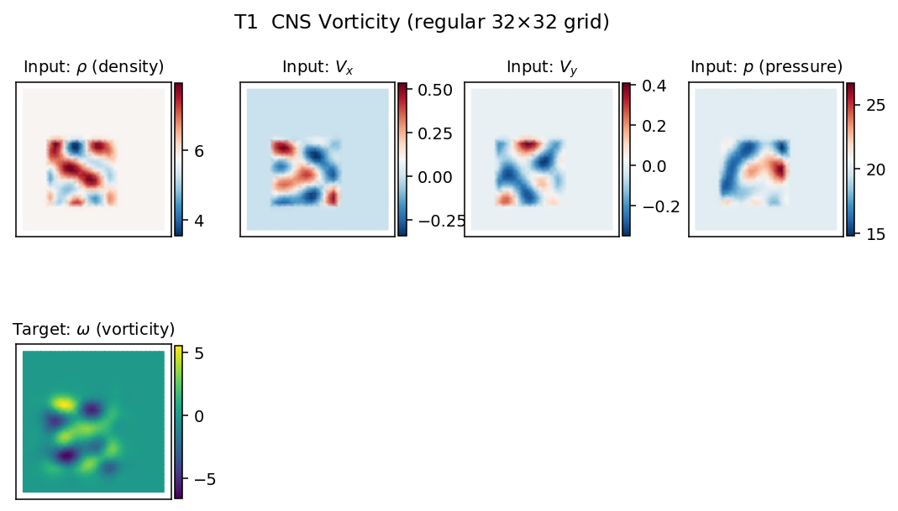
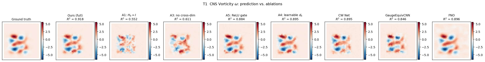
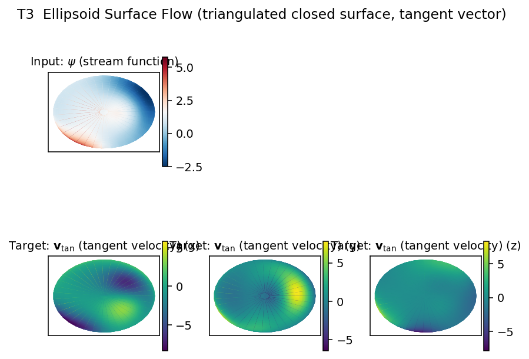
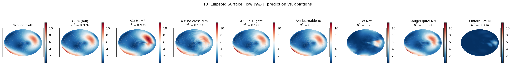
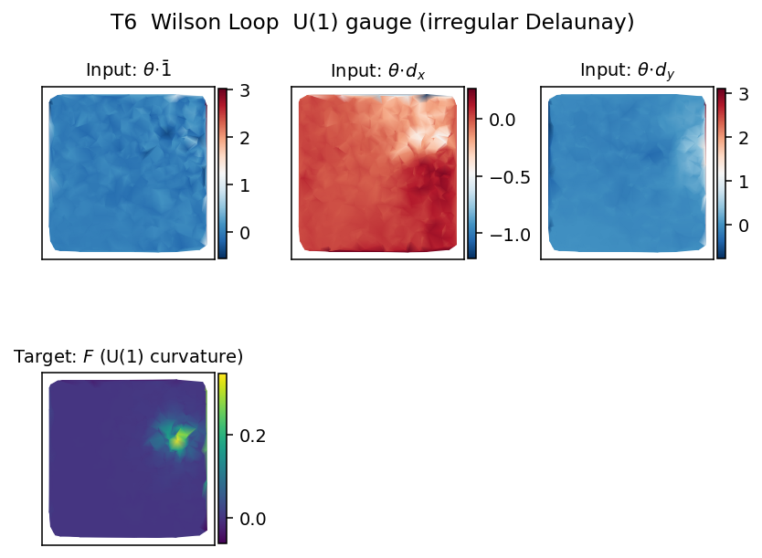
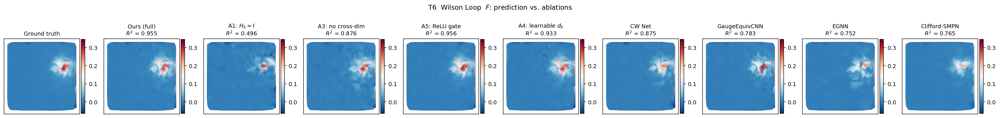
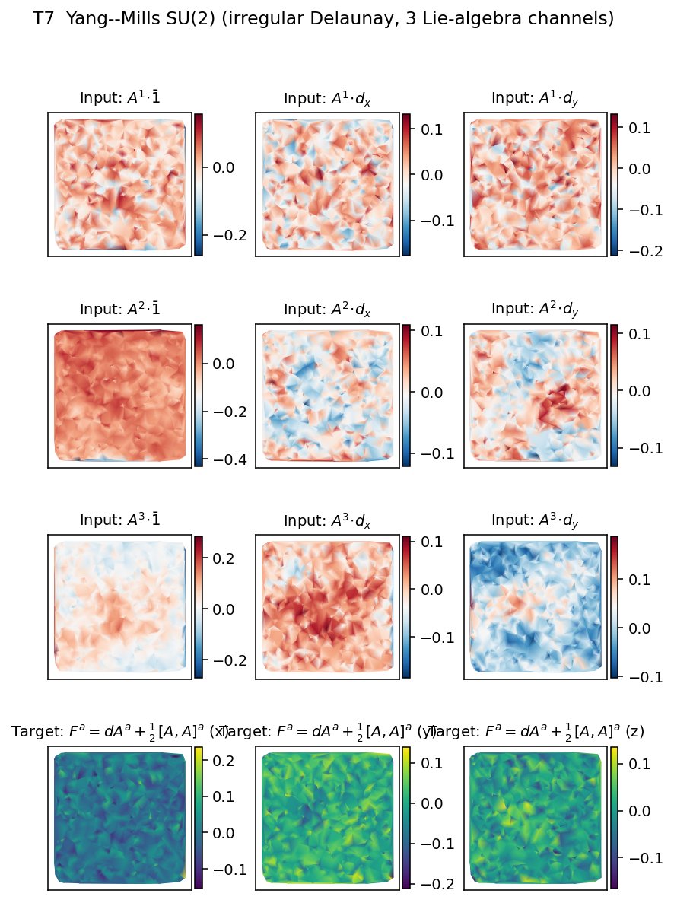
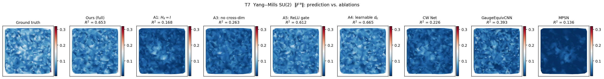

# Ablation Study: Gauge-Structured Hodge MP

Each ablation variant flips **one** design pillar against the full model (A0, reused from the 100-epoch main benchmark).  All ablation variants are retrained from scratch with **50 epochs, seed 42, cosine 1e-3 -> 1e-5**.  Tasks cover three representative regimes: regular-grid CNS vorticity, curved-surface tangent vector reconstruction on an ellipsoid, and U(1) abelian gauge Wilson loop.  Full configuration in `ablation/variants.py`.

## What each ablation isolates
- **Identity metric ($H_k = I$)** removes the learnable gauge metric, isolating the contribution of metric learning.
- **No cross-dim transfer ($\alpha = 1$)** drops the $d_{k-1} H x_{k-1}$ and $d_k^\top H x_{k+1}$ messages, isolating the contribution of cross-dimensional communication.
- **ReLU replaces norm-gated** substitutes element-wise ReLU for the norm-gated update, isolating the contribution of the $O(C)$-equivariant nonlinearity.
- **Learnable $d_k$** keeps the CW sparsity pattern but makes the coboundary entries trainable, isolating the contribution of the $d^2 = 0$ hard constraint.

## Table 1: $R^2$ on held-out test split

| Variant | CNS vorticity | Ellipsoid surface flow | Wilson loop (U(1)) | Yang--Mills SU(2) | Mean $\Delta$ $R^2$ vs A0 |
|---|---|---|---|---|---|
| Full model | **0.9179** | **0.9716** | **0.9548** | **0.6527** | 0 |
| Identity metric ($H_k = I$) | 0.5521 | 0.9354 | 0.4961 | 0.1682 | -0.3363 |
| No cross-dim transfer ($\alpha = 1$) | 0.6112 | 0.9269 | 0.8763 | 0.2626 | -0.2050 |
| ReLU replaces norm-gated | 0.8837 | 0.9603 | 0.9557 | 0.6120 | -0.0213 |
| Learnable $d_k$ | 0.8952 | 0.9683 | 0.9327 | 0.6649 | -0.0090 |

## Table 2: SSIM (global data-range, clipped)

| Variant | CNS vorticity | Ellipsoid surface flow | Wilson loop (U(1)) | Yang--Mills SU(2) | Mean $\Delta$ SSIM vs A0 |
|---|---|---|---|---|---|
| Full model | **0.9844** | **0.9882** | **0.9934** | **0.8522** | 0 |
| Identity metric ($H_k = I$) | 0.9257 | 0.9738 | 0.9702 | 0.7672 | -0.0453 |
| No cross-dim transfer ($\alpha = 1$) | 0.9360 | 0.9712 | 0.9939 | 0.7983 | -0.0297 |
| ReLU replaces norm-gated | 0.9823 | 0.9859 | 0.9979 | 0.9029 | +0.0127 |
| Learnable $d_k$ | 0.9837 | 0.9883 | 0.9968 | 0.9175 | +0.0170 |

## Table 3: NRMSE = RMSE / range(y)  (lower is better)

| Variant | CNS vorticity | Ellipsoid surface flow | Wilson loop (U(1)) | Yang--Mills SU(2) | Mean $\Delta$ NRMSE vs A0 |
|---|---|---|---|---|---|
| Full model | **0.0095** | **0.0095** | **0.0032** | **0.0212** | 0 |
| Identity metric ($H_k = I$) | 0.0167 | 0.0107 | 0.0051 | 0.0176 | +0.0017 |
| No cross-dim transfer ($\alpha = 1$) | 0.0155 | 0.0114 | 0.0025 | 0.0166 | +0.0007 |
| ReLU replaces norm-gated | 0.0085 | 0.0080 | 0.0015 | 0.0120 | -0.0033 |
| Learnable $d_k$ | 0.0081 | 0.0072 | 0.0019 | 0.0112 | -0.0038 |

## Table 4: parameter count (M)

| Variant | CNS vorticity | Ellipsoid surface flow | Wilson loop (U(1)) | Yang--Mills SU(2) |
|---|---|---|---|---|
| Full model | 0.424 | 0.372 | 0.433 | 0.510 |
| Identity metric ($H_k = I$) | 0.424 | 0.372 | 0.433 | 0.510 |
| No cross-dim transfer ($\alpha = 1$) | 0.424 | 0.372 | 0.433 | 0.510 |
| ReLU replaces norm-gated | 0.424 | 0.372 | 0.433 | 0.510 |
| Learnable $d_k$ | 0.435 | 0.386 | 0.446 | 0.522 |

## Qualitative visualizations
Per-task inputs are rendered once (`ablation/figures/{task}/input.png`); per-task predictions from the full model plus every ablation variant on the same held-out sample are in `output_comparison.png`.

### CNS vorticity



### Ellipsoid surface flow



### Wilson loop (U(1))



### Yang--Mills SU(2)



## Summary
Worst-case $R^2$ drop for each ablation (across the three tasks):

| Ablation | Worst task | $\Delta R^2$ |
|---|---|---|
| Identity metric ($H_k = I$) | Yang--Mills SU(2) | -0.485 |
| No cross-dim transfer ($\alpha = 1$) | Yang--Mills SU(2) | -0.390 |
| ReLU replaces norm-gated | Yang--Mills SU(2) | -0.041 |
| Learnable $d_k$ | CNS vorticity | -0.023 |

Removing the learnable metric or the cross-dimensional transfer causes large accuracy drops on CNS vorticity and the Wilson loop, where the discrete operators $d_0$ and $d_1$ act jointly; the ellipsoid surface flow is affected much less, consistent with its physical map being a single coexact operation. Making $d_k$ learnable or replacing the norm-gated nonlinearity with ReLU leaves accuracy essentially unchanged, while the diagnostics table shows that both changes break exact $d^2 = 0$ and exact $O(C)$ equivariance respectively.

## Reproducibility
```bash
bash ablation/run_all.sh                         # run all 12 ablation trainings (50 epochs)
python3 ablation/dump_baseline_outputs.py        # regenerate baseline prediction pkls
python3 ablation/visualize_inputs.py  --sample 9500
python3 ablation/visualize_outputs.py --sample 9500
python3 ablation/aggregate.py                    # regenerate this file + summary.json
```
